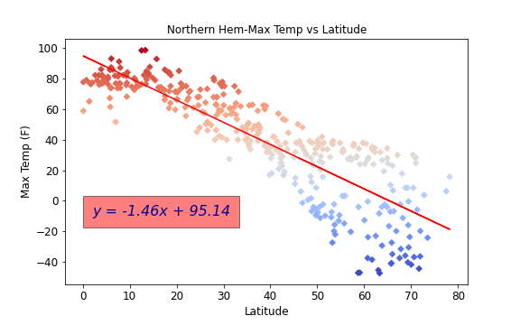
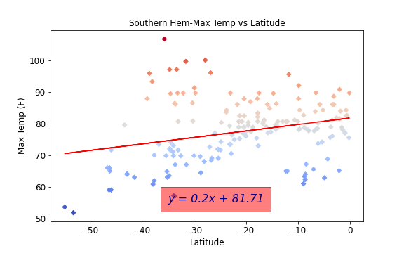
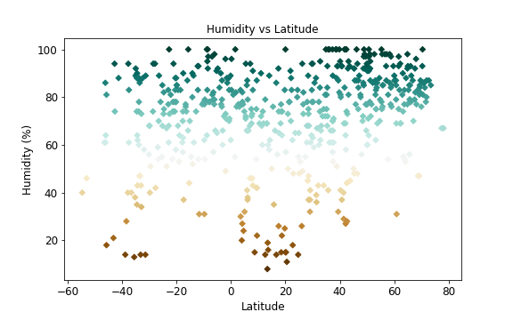
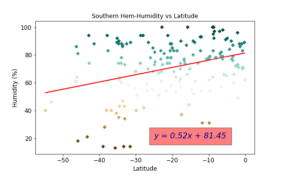
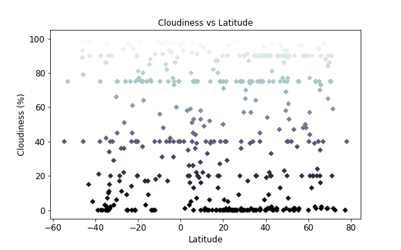
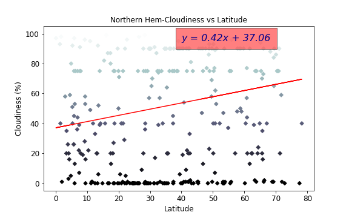
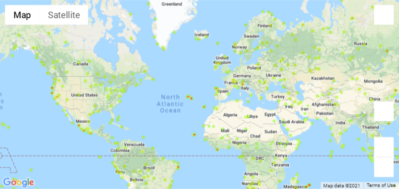

# Python API Project - Weather Around the World

## Background
---
Whether financial, political, or social -- data's true power lies in its ability to answer questions definitively. Utilizing Python requests, APIs, and JSON traversals to answer a fundamental question: "What's the weather like as we approach the equator?"

Once the key weather factors have been analyzed, take the project a step further by parsing weather data from a random group of cities by a predetermined set of 'desirable' critera. Using this dataset of cities by desireable weather condition, find hotels the user might want to stay at. 

---
## Resources
* [OpenWeatherAPI](https://openweathermap.org/current) : Access current weather data for any location on Earth including over 200,000 cities! We collect and process weather data from different sources such as global and local weather models, satellites, radars and vast network of weather stations. Data is available in JSON, XML, or HTML format.

* [GooglePlacesAPI](https://developers.google.com/places/web-service/search) : The Places API lets you search for place information using a variety of categories, including establishments, prominent points of interest, and geographic locations. You can search for places either by proximity or a text string. A Place Search returns a list of places along with summary information about each place; additional information is available via a Place Details query.

---
## Key Python Libraries
* [Matplotlib](https://matplotlib.org/): Plotting 
* [pandas](https://pandas.pydata.org/): Dataframes
* [numpy](https://numpy.org/): Arrays
* [requests](https://pypi.org/project/requests/): APIs
* [gmaps](https://pypi.org/project/gmaps/): Jupyter NB Map Widget
* [scipy](https://www.scipy.org/): Linear regression (specific to this use case)
* [citipy](https://pypi.org/project/citipy/): Random city generator

---
## WeatherPy Results
Let's take a look at what weather conditions look like versus latitude!

### Temperature

*Figure 1: Temperature vs Latitude - Warmer temperatures in southern hemisphere indicate summer has arrived. Parabolic curvature peaks around the equator at 0 deg latitude.*

*Figures 2 and 3: Temperature vs Latitude by Hemisphere - Strong indication that temperatures increase toward the equator in the Northern Hemisphere. Seasonal influence in Southern Hemisphere dampens the slope, but analagous trend remains visible*

---
### Humidity

*Figure 4: Humidity vs Latitude -  Overall Earth is a relatively moist planet, with a few dry spots shouldering the equator.*

*Figures 5 and 6: Humidity vs Latitude by Hemisphere - Definitive bands of 'dryness' appear in both hemispheres. While the nothern hemisphere gains moisture content at increasing latitude, the southern hemisphere becomes more arid as you progress away from the equator.*

---
### Cloudiness

*Figure 7: Cloudiness vs Latitude -  Cloudiness appears to be relatively evenly distributed versus latitude. Perhaps just slightly cloudier in the Northern Hemisphere currently during winter.*

*Figures 8 and 9: Cloudiness vs Latitude by Hemisphere - While the data shows fairly even distribution overall, cloud cover increase from south pole to north pole. Perhaps as an effect of seasonal influence or perhaps more data is needed in the southern hemisphere.*

---
### Wind Speed

*Figure 10: Wind Speed vs Latitude -  Very slight increase in windspeed in the Northern Hemisphere during the winter months.*

*Figures 11 and 12: Wind Speed vs Latitude by Hemisphere - Windspeed very evenly distributed in the northern hemisphere with little to no change latitudinally. Wind speeds in the southern hemisphere increase mildly from equator to south pole.*

---
## VacationPy Results
With the csv file generated in WeatherPy above, take a look at Humidity versus Latitude on a google map. Additionaly filter down data with the following metrics and find the first closest hotel to the city centroid via the GooglePlacesAPI. 

*Figure 13: Humidity Density by Random Locale*

### Selected Weather Conditions
* 70F < 'Max Temperature' > 80F
* Wind Speed < 10mph
* Cloudiness == 0%

*Figure 13: Hotel location by Select Condition*